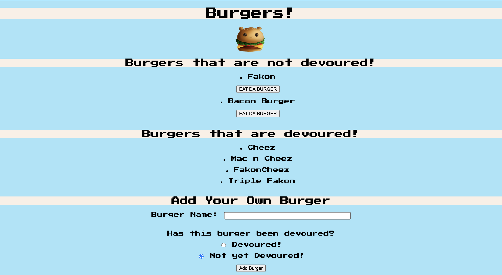

  # Burger-Database
  

  

  # Description
  A restaurant app that lets users input the names of burgers they'd like to eat! Utilizing MySQL, Node, Express, Handlebars and a homemade ORM. Yum!
  # Table Of Contents
  
  - [Installation Instructions](#installation-instructions)
  - [Usage](#usage)
  - [Licenses](#licenses)
  - [Contributing](#contributing)
  - [Tests](#tests)
  
  # Installation Instructions
  clone this repo to your local computer
  # Usage 
  Either launch the app straight from Heroku, or clone it to your local computer, navigate to your home directory, type node server.js, and open localhost:8080 in your browser
  # License
  Copyright (c) 2020, Nay Wilkins
All rights reserved.
  This source code is licensed under the GNU General Public License v3.0 found in the
LICENSE file in the root directory of this source tree. 
  # Contributing
  
  - Fork The Project Repo
  - Clone to your local computer
  - Navigate to your local repo
  - Pull the latest changes
  - Create a New Branch
  - Make your changes
  - Commit your changes
  - Push your changes to your fork
  - Open a pull request
  
  
  # Tests
  n/a
  # Questions
  
  [Github Profile Link](https://github.com/naywilkins512)
  - email: [nathanwilkins01@gmail.com](mailto:nathanwilkins01@gmail.com) with your name in the subject for any questions